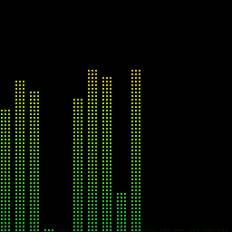
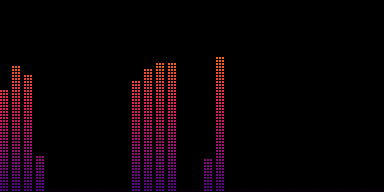

# Equalize

 

A graphic equaliser for an RGB LED matrix on a Raspberry Pi. Play music on your
Sonos from your iPhone, and the panel on the wall bounces along to it: bass on
the left, treble on the right, bars shooting up on each beat and falling back
under gravity.

**No microphone.** The Pi never listens to the room. It joins your AirPlay
group as a silent speaker called **Equalize**, receives the same digital audio
your Sonos gets, perfectly in time, and draws it.

**Status:** first version, tested off-Pi (see *What has and hasn't been tested*).
**Stack:** Raspberry Pi · rpi-rgb-led-matrix · shairport-sync (AirPlay 2) · Python · numpy · Flask
**Panels:** 64×32, 64×64, 128×64 (two 64×64 side by side).

Part of the [xpdr.aero](https://github.com/captaincomplex/captaincomplex.github.io) projects.
Grown from Spotipi Photo, whose display loop, web panel, timer, quiet hours,
sunrise/sunset dimmer and Spotify login it reuses.

---

## Why AirPlay, and not Spotify's own data

To draw real bars you need the actual sound. Spotify never lets third-party
programs have the audio, and on **27 November 2024** it also withdrew its
`audio-analysis` data (the timeline of loudness and pitch that visualisers used
to fake it) from new apps. Paid replacements such as Musicae return one summary
per song (tempo, energy, a *count* of beats), not a timeline, so bars built from
them only pulse at the song's tempo.

The sound only exists on the device that plays it. Your Sonos fetches Spotify
straight from the internet, so nothing in the house can tap it there. The fix
is to have your iPhone send the music to the Sonos **and** to the Pi at once.
That's AirPlay 2 multi-room, and Apple's protocol keeps every speaker in the
group, including the silent one, on the same clock.

```
iPhone (Spotify, Apple Music, anything)
   │  AirPlay 2 to two "speakers" at once, kept in step by Apple's timing
   ├──────────────► Sonos                → you hear it
   └──────────────► Pi: shairport-sync   → ALSA loopback (a virtual cable)
                                              │
                                        equalize.py: FFT → bars → LED panel
                                        client/app.py: web panel on :80
```

## Using it

On your iPhone, open the AirPlay picker (Control Centre → the AirPlay icon on
the music tile, or the speaker icon in Spotify) and tick **your Sonos** *and*
**Equalize**. Press play. That's it.

Works from an iPhone, iPad, Mac or Apple TV, with any app. The Pi makes no sound.

### Display modes (web panel)
- **On (auto)**: bars whenever music is arriving over AirPlay; dark otherwise.
- **Spotify only**: the same, but only while Spotify says your account is
  playing. Needs the optional Spotify login.
- **Always on**: bars even in silence (a faint floor row).
- **Off**.

Plus: live **brightness**, **colours** (*vapor*, the logo's sunset with cyan
peak caps and the default; classic, rainbow, ice, sunset; and *album*, which
takes the bar colours from the cover of the song playing),
**number of bars**, **sensitivity**, **peak caps**, a **screen timer**, **quiet
hours** and a **sunrise/sunset dimmer**, all as in Spotipi Photo. A live
dashboard shows a snapshot of the panel, the song, and the frame rate.

## Hardware

Same build as Spotipi Photo: see its `HARDWARE.md`. Short version: **Raspberry
Pi 3 Model A+, Adafruit RGB Matrix Bonnet, a 64×64 3mm panel, one 5V 4A
supply**. For 128×64, chain a second 64×64 (and a bigger supply: 5V 8A). A
64×64 needs the bonnet's **E jumper** soldered. Nothing extra is needed for the
sound: no microphone, no sound card.

Pi 5: not recommended yet, for the same reason as in Spotipi Photo (whether
Adafruit's installer builds the Pi 5 driver hasn't been confirmed on real
hardware).

## Installing

On a fresh **Raspberry Pi OS Lite (64-bit)**, the current Debian 13 "trixie"
release:

1. Install the LED driver with Adafruit's installer. `install_pi.sh` prints the
   exact commands if it's missing.
2. Copy this folder to the Pi as `~/equalize`, then:
   ```bash
   cd ~/equalize
   sudo bash install_pi.sh
   sudo reboot
   ```
   It builds the AirPlay 2 receiver from pinned releases (**shairport-sync
   5.5.2**, **NQPTP 1.2.8**, the newest as of 28 Sep 2026), sets up the
   loopback, turns onboard sound off, and creates the services. It asks for
   Spotify details; press Enter to skip.
3. Open `http://<pi-name>.local` on your phone. Pick **Demo pattern** as the
   sound source to check the panel, then switch back to **AirPlay**.

**Spotify (optional).** Reuse Spotipi Photo's token: copy its `.cache-<username>`
file across and give the installer its path, plus the same Client ID and Secret.
Spotify now allows new developers only one app, so reusing the existing one
matters. Otherwise run `bash generate-token.sh`.

**Sharing a Pi with Spotipi Photo** works for the web panels (Equalize moves to
port 8080), but only one program can drive the LED panel at a time; the
installer tells you how to switch.

## Seeing it without a Pi

```bash
python3 tools/preview.py --size 128x64 --theme sunset     # writes preview.gif
python3 tools/preview.py --wav song.wav                   # from a real recording
python3 -m pytest                                         # the tests
python3 image/make_logo.py                                # rebuild the logo files (needs cairosvg)
```

## The logo

A vaporwave sun setting over a neon grid, except the sun is made of equaliser
bars. Each bar stops short of the circle, and its peak cap hangs where the
circle's edge would be, so the caps trace the sun's outline. The wordmark is
set in dot-matrix, the way the panel draws. The palette (night purple, a sun
running pale yellow to peach, pink and purple, and a cyan grid) is shared by
the icon, the web panel and the *vapor* LED theme.
These run the real analysis and drawing code on any computer with numpy and Pillow.

## Files

```
equalize/
├── install_pi.sh             # Pi installer
├── generate-token.sh         # optional Spotify login
├── config/
│   ├── rgb_options.ini       # panel size and wiring
│   ├── shairport-sync.conf   # the AirPlay receiver's settings
│   ├── equalize.service      # display service
│   └── equalize-web.service  # web panel service
├── python/
│   ├── equalize.py           # the display program
│   ├── audio_source.py       # AirPlay loopback reader, demo pattern, silence detector
│   ├── spectrum.py           # sound → bar heights (FFT, bands, auto gain, gravity)
│   ├── render.py             # bar heights → picture; colour themes
│   ├── display_logic.py      # on/off rules, timer, quiet hours, dimmer
│   ├── state.py              # settings file + live status
│   ├── getSongInfo.py        # Spotify "now playing" (optional)
│   ├── generateToken.py
│   └── client/               # web panel
├── tools/preview.py          # animated preview on any computer
├── image/make_logo.py        # builds the logo, icons, favicon and banner from one geometry
├── tests/
├── GLOSSARY.md               # every technical term, in plain English
└── TODO.md
```

## What has and hasn't been tested

**Tested (28 Sep 2026, off-Pi):** the full display loop at 40 fps against a
stand-in LED driver; the web panel in a browser, with settings reaching the
display within half a second; the AirPlay reader fed a real-time 16-bit stereo
stream; the three panel sizes and five colour themes, by looking at the frames;
33 automated tests.

**Not yet tested:** on a real Pi with a real panel; shairport-sync into the
ALSA loopback; AirPlay grouping with a Sonos; how closely the bars line up with
the Sonos by eye (the timing nudge in `config/shairport-sync.conf` is an
estimate). See `TODO.md`.

## Licence

Free and open source under the [MIT licence](LICENSE). Equalize grew out of
Spotipi Photo, which is built on [Spotipi](https://github.com/ryanwa18/spotipi)
by Ryan Ward (MIT, copyright 2020). His copyright notice is kept in `LICENSE`,
as that licence requires.

## Troubleshooting
- **Equalize isn't in the AirPlay picker**: `sudo systemctl status shairport-sync nqptp`.
  The Pi and the phone must be on the same network.
- **Picker shows it, bars don't move**: the dashboard's *Sound* line should say
  *music arriving*. Check `aplay -l` lists a **Loopback** card (reboot after
  installing), and `journalctl -u shairport-sync -n 30`.
- **Bars early or late against the Sonos**: change
  `audio_backend_latency_offset_in_seconds` in `/etc/shairport-sync.conf`
  (negative = earlier), then `sudo systemctl restart shairport-sync`.
- **Panel flickers**: raise `gpio_slowdown` in `config/rgb_options.ini`, restart
  `equalize`. Check `dtparam=audio=off` is set.
