# Equalize

| LED ring (default) | Ring | LED grid | Dance |
|:-:|:-:|:-:|:-:|
| 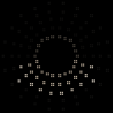 |  | 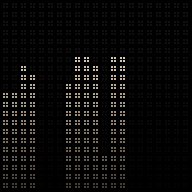 | 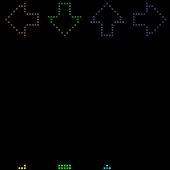 |

| Sunset | Disc | Meter | Equals |
|:-:|:-:|:-:|:-:|
| 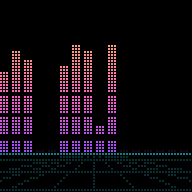 | 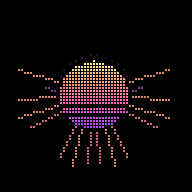 | 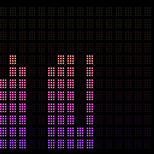 | 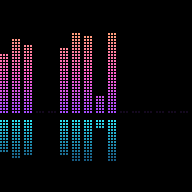 |
| **Mirror** (Ocean) | **Wave** (Aurora) | **Waterfall** (Thermal) | **Needle** (Amber) |
| 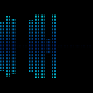 | 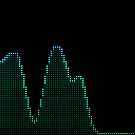 | 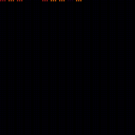 | 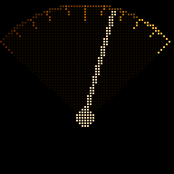 |
| **Analyser** (Classic) | **Scope** (Ocean) | **Trails** (Fire) | **Plasma** (Aurora) |
| 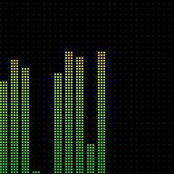 | 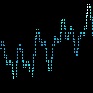 | 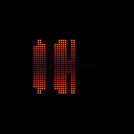 | 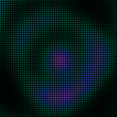 |

A graphic equaliser for an RGB LED matrix on a Raspberry Pi. Play music on your
Sonos from your iPhone, and the panel on the wall bounces along to it: bass on
the left, treble on the right, bars shooting up on each beat and falling back
under gravity.

**No microphone.** The Pi never listens to the room. It joins your AirPlay
group as a silent speaker called **Equalize**, receives the same digital audio
your Sonos gets, perfectly in time, and draws it.

**Status:** first version, tested off-Pi (see *What has and hasn't been tested*).
**Stack:** Raspberry Pi · rpi-rgb-led-matrix · shairport-sync (AirPlay 2) · Python · numpy · Flask
**Panels:** 64×32, 64×64, 128×64 (two 64×64 side by side), and upright: 32×64 (a 64×32 on its side) and 64×128 (two 64×64 one above the other). Upright panels are set with `rotate` in `config/rgb_options.local.ini` (see the notes in `rgb_options.ini`).

Part of the [xpdr.aero](https://github.com/captaincomplex/captaincomplex.github.io) projects.
Grown from Spotipi Photo, whose display loop, web panel, timer, quiet hours,
sunrise/sunset dimmer and Spotify login it reuses.

---

## Why AirPlay, and not Spotify's own data

To draw real bars you need the actual sound. Spotify never lets third-party
programs have the audio, and on **27 November 2024** it also withdrew its
`audio-analysis` data (the timeline of loudness and pitch that visualisers used
to fake it) from new apps. Paid replacements such as Musicae return one summary
per song (tempo, energy, a *count* of beats), not a timeline, so bars built from
them only pulse at the song's tempo.

The sound only exists on the device that plays it. Your Sonos fetches Spotify
straight from the internet, so nothing in the house can tap it there. The fix
is to have your iPhone send the music to the Sonos **and** to the Pi at once.
That's AirPlay 2 multi-room, and Apple's protocol keeps every speaker in the
group, including the silent one, on the same clock.

```
iPhone (Spotify, Apple Music, anything)
   │  AirPlay 2 to two "speakers" at once, kept in step by Apple's timing
   ├──────────────► Sonos                → you hear it
   └──────────────► Pi: shairport-sync   → ALSA loopback (a virtual cable)
                                              │
                                        equalize.py: FFT → bars → LED panel
                                        client/app.py: web panel on :80
```

## Using it

Two ways in. The Pi makes no sound either way; your speakers do.

**AirPlay** (Apple Music and most apps): open the AirPlay picker (Control
Centre → the AirPlay icon on the music tile) and tick **your Sonos** *and*
**Equalize**. Press play. Works from an iPhone, iPad, Mac or Apple TV.

**Spotify Connect** (Spotify): Spotify's iPhone app uses the older AirPlay,
which plays to **one** speaker at a time, so it can't play to the Sonos and
Equalize together ([Engadget](https://www.engadget.com/spotify-ios-airplay-2-support-plans-ditched-184633525.html)).
Instead, if you said yes to Spotify Connect when installing, pick **Equalize**
in Spotify's device list. The Pi plays the music on to the speakers ticked
under *Spotify speakers* in the control panel (over AirPlay 2, so they stay in
sync with each other) and draws it in step. Works from any phone with Spotify,
guests' Android phones included. Needs Spotify Premium.

```
Spotify app --("Equalize")--> librespot (Raspotify) --pipe--> OwnTone
    OwnTone --AirPlay 2--> your speakers
           \--in-step copy--> Equalize --> LED panel
```

### Styles
Sixteen ways to draw the music, plus plain bars. The first three match the
logos (you choose the logo at the bottom of the control panel):
- **LED ring** (default): rings of LED dots round the middle, the inner ring
  always faintly lit, each spoke lighting outward further where it's louder.
- **Ring**: rays round an empty circle, longer where it's louder.
- **LED grid**: big round "LEDs" in columns, the unlit ones faintly showing.

- **Dance** (best in Rainbow): Dance Dance Revolution. Four lanes, ← bass,
  ↓ low-mid, ↑ high-mid, → treble; each time a lane's part of the music hits,
  an arrow scrolls up to its target, which flashes as it arrives.

The next four come from the first logo designs, and the last four from the
music players of the early 2000s:
- **Sunset**: bars standing on a horizon, the sun's stripes cut through
  them, a neon grid floor below.
- **Disc**: the spectrum as a ring of rays around a small striped sun.
- **Meter**: a hi-fi LED meter, stacked segments with the unlit ones faintly
  glowing and a lit segment marking each peak.
- **Equals**: bars rising from a centre line with their reflection below.
- **Mirror**: bars growing up and down from the middle of the panel at once.
- **Wave**: one smooth line through the tops of the bars, softly filled below,
  like a range of hills moving with the music.
- **Waterfall**: the last few seconds of music scrolling down the panel, newest
  at the top, brighter where it was louder, so you can see the beat.
- **Needle**: an old hi-fi's needle meter. On a wide panel there are two:
  bass on the left, treble on the right.
- **Analyser**: Winamp's spectrum analyser: thin bars whose colours are fixed
  by height, grey peak dots, a faint grid behind.
- **Scope**: Winamp's oscilloscope, drawing the sound wave itself. It starts
  each picture where the wave crosses zero, so a held note stands still.
- **Trails**: each picture grows and fades behind the next, so the music
  flies out of the middle towards you, as in MilkDrop or Windows Media Player.
- **Plasma**: slow flowing colour, pushed into ripples by the bass, like
  Media Player's "Ambience". Brighter when the music is louder.

Every style works with every colour theme and every panel size. (Equals keeps
its cyan reflection with *vapor*; with other colours it reflects their own.) Pick one in
the web panel, which shows a live preview of each.

### Display modes (web panel)
- **On (auto)**: bars whenever music is arriving over AirPlay; dark otherwise.
- **Spotify only**: the same, but only while Spotify says your account is
  playing. Needs the optional Spotify login.
- **Always on**: bars even in silence (a faint floor row).
- **Off**.

Plus: live **brightness**, **colours** (*warm white*, the default; vapor,
classic, rainbow, ice, sunset, fire, ocean, forest, aurora, amber, pastel,
thermal and teal; and *album*, which takes the bar
colours from the cover of the song playing, and needs the Spotify login),
**number of bars**, **sensitivity**, **peak caps**, a **screen timer**, **quiet
hours** and a **sunrise/sunset dimmer**, all as in Spotipi Photo. A live
dashboard shows a snapshot of the panel, the song, and the frame rate.

## Hardware

Same build as Spotipi Photo: see its `HARDWARE.md`. Short version: **Raspberry
Pi 3 Model A+, Adafruit RGB Matrix Bonnet, a 64×64 3mm panel, one 5V 4A
supply**. For 128×64, chain a second 64×64 (and a bigger supply: 5V 8A). A
64×64 needs the bonnet's **E jumper** soldered. Nothing extra is needed for the
sound: no microphone, no sound card.

Pi 5: not recommended yet, for the same reason as in Spotipi Photo (whether
Adafruit's installer builds the Pi 5 driver hasn't been confirmed on real
hardware).

## Installing

On a fresh **Raspberry Pi OS Lite (64-bit)**, the current Debian 13 "trixie"
release:

1. Install the LED driver with Adafruit's installer. `install_pi.sh` prints the
   exact commands if it's missing.
2. Copy this folder to the Pi as `~/equalize`, then:
   ```bash
   cd ~/equalize
   sudo bash install_pi.sh
   sudo reboot
   ```
   It builds the AirPlay 2 receiver from pinned releases (**shairport-sync
   5.5.2**, **NQPTP 1.2.8**, the newest as of 28 Sep 2026), sets up the
   loopback, turns onboard sound off, and creates the services. It asks for
   Spotify details; press Enter to skip.
3. Open **http://equalize.local** on your phone (the installer gives the Pi
   that second name). Pick **Demo pattern** as the
   sound source to check the panel, then switch back to **AirPlay**.

**Spotify (optional).** Reuse Spotipi Photo's token: copy its `.cache-<username>`
file across and give the installer its path, plus the same Client ID and Secret.
Spotify now allows new developers only one app, so reusing the existing one
matters. Otherwise run `bash generate-token.sh`.

### Sharing a Pi with Spotipi Photo

Both can be installed on one Pi. Only one can light the panel at a time, so
they take turns, and Equalize's control panel gets a **Sharing with Spotipi
Photo** switch:

- **Auto** (default): Equalize while music arrives over AirPlay; Spotipi Photo's
  album covers and photos the rest of the time. In practice, *how you play*
  decides: AirPlay to your Sonos **and** Equalize for the equaliser, or play to
  the Sonos alone for album covers.
- **Equalize** or **Spotipi Photo**: always that one.

How it works: when AirPlay music starts, shairport-sync runs
`/usr/local/bin/equalize-panel airplay-start`, which stops Spotipi Photo's
display and starts Equalize's. Ten seconds after the music stops it runs
`airplay-stop`, which swaps back. `equalize.service` also declares
`Conflicts=spotipi.service`, so systemd itself never lets both run. The two web
panels stay up throughout, each at its own name: **http://equalize.local** and
**http://spotipi.local** (or whatever the Pi is called). A small front door on
port 80 (`python/door.py`) sends each visit to the right panel; behind it,
Equalize's panel listens on 8080 and Spotipi Photo's on 8081. Spotipi Photo
needs the version with `SPOTIPI_PORT` (October 2026 or later).

Expect a pause of a couple of seconds while the panel changes hands.
[Unverified: not yet timed on a Pi.] If Spotipi Photo's own auto-updater
restarts it while the equaliser is showing, Spotipi Photo takes the panel back
until the next AirPlay session.

## Decisions
- **5 Oct 2026: Raspotify follows its updates instead of being pinned.**
  Everything else here is pinned to a release (shairport-sync 5.5.2, NQPTP
  1.2.8, OwnTone 29.3). Spotify changes how it delivers music from time to
  time, and an old librespot then stops playing: Raspotify 0.48.2 (Jul 2026)
  says "Fixes broken audio CDN", and librespot's last tagged release (0.8.0,
  Nov 2025) predates it. So `config/install_spotify_connect.sh` installs
  Raspotify from its own apt repository, and `apt upgrade` keeps it working.
- **5 Oct 2026: OwnTone is built from its release tarball.** It isn't in
  Debian (its web interface doesn't meet Debian's rules), and the tarball
  carries the finished web interface, so no extra tools are needed.

## Seeing it without a Pi

```bash
python3 tools/preview.py --size 128x64 --style disc       # writes preview.gif
python3 tools/preview.py --wav song.wav                   # from a real recording
python3 -m pytest                                         # the tests
python3 image/make_logo.py                                # rebuild the logo files (needs cairosvg)
```

## The logo

A vaporwave sun setting over a neon grid, except the sun is made of equaliser
bars. Each bar stops short of the circle, and its peak cap hangs where the
circle's edge would be, so the caps trace the sun's outline. The wordmark is
set in dot-matrix, the way the panel draws. The palette (night purple, a sun
running pale yellow to peach, pink and purple, and a cyan grid) is shared by
the icon, the web panel and the *vapor* LED theme.
These run the real analysis and drawing code on any computer with numpy and Pillow.

## Files

```
equalize/
├── install_pi.sh             # Pi installer
├── generate-token.sh         # optional Spotify login
├── config/
│   ├── rgb_options.ini       # panel size and wiring (defaults; your changes go in rgb_options.local.ini)
│   ├── shairport-sync.conf   # the AirPlay receiver's settings
│   ├── equalize.service      # display service
│   ├── equalize-web.service  # web panel service
│   ├── equalize-panel        # hands the LED panel between Equalize and Spotipi Photo
│   ├── equalize-panel.service    # runs it at boot
│   ├── equalize-panel.sudoers    # lets the AirPlay receiver run it, and nothing else
│   ├── equalize-name.sh/.service # announces equalize.local
│   ├── equalize-door.service     # the front door on port 80 (with Spotipi Photo)
│   ├── install_spotify_connect.sh  # the optional Spotify Connect route
│   ├── owntone.conf, raspotify.conf, raspotify-override.conf
│   └── equalize-spotify-watch.service
├── python/
│   ├── equalize.py           # the display program
│   ├── audio_source.py       # AirPlay and Spotify Connect readers, demo pattern, silence detector
│   ├── spectrum.py           # sound → bar heights (FFT, bands, auto gain, gravity)
│   ├── render.py             # bar heights → picture; colour themes
│   ├── styles.py             # every style (LED ring, Ring, LED grid, Sunset ... Plasma)
│   ├── door.py               # the front door: equalize.local / spotipi.local
│   ├── spotify_watch.py      # hands the panel over when Spotify Connect plays
│   ├── display_logic.py      # on/off rules, timer, quiet hours, dimmer
│   ├── state.py              # settings file + live status
│   ├── getSongInfo.py        # Spotify "now playing" (optional)
│   ├── generateToken.py
│   └── client/               # web panel
├── tools/preview.py          # animated preview on any computer
├── image/build_logos.py      # the three logos (LED ring, Ring, LED grid), icons and banner
├── image/make_logo.py        # the first, vaporwave logo (no longer used)
├── tests/
├── GLOSSARY.md               # every technical term, in plain English
└── TODO.md
```

## What has and hasn't been tested

**Tested (28 Sep 2026, off-Pi):** the full display loop at 40 fps against a
stand-in LED driver; the web panel in a browser, with settings reaching the
display within half a second; the AirPlay reader fed a real-time 16-bit stereo
stream; the three panel sizes and five colour themes, by looking at the frames;
33 automated tests.

**Not yet tested:** on a real Pi with a real panel; shairport-sync into the
ALSA loopback; AirPlay grouping with a Sonos; how closely the bars line up with
the Sonos by eye (the timing nudge in `config/shairport-sync.conf` is an
estimate). See `TODO.md`.

## Licence

Free and open source under the [MIT licence](LICENSE). Equalize grew out of
Spotipi Photo, which is built on [Spotipi](https://github.com/ryanwa18/spotipi)
by Ryan Ward (MIT, copyright 2020). His copyright notice is kept in `LICENSE`,
as that licence requires.

## Troubleshooting
- **Equalize isn't in the AirPlay picker**: `sudo systemctl status shairport-sync nqptp`.
  The Pi and the phone must be on the same network.
- **Picker shows it, bars don't move**: the dashboard's *Sound* line should say
  *music arriving*. Check `aplay -l` lists a **Loopback** card (reboot after
  installing), and `journalctl -u shairport-sync -n 30`.
- **Bars early or late against the Sonos**: change
  `audio_backend_latency_offset_in_seconds` in `/etc/shairport-sync.conf`
  (negative = earlier), then `sudo systemctl restart shairport-sync`.
- **Panel flickers**: raise `gpio_slowdown` in `config/rgb_options.local.ini`, restart
  `equalize`. Check `dtparam=audio=off` is set.
